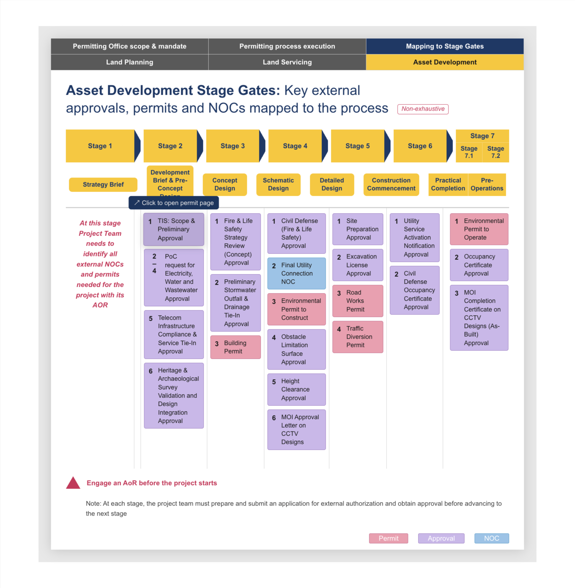

# Asset Development Stage Gates (SPFx)

SharePoint Framework web part that visualizes the Asset Development Stage Gates process and maps key external approvals, permits, and NOCs across stages.

## Screenshot



## Built With

- SharePoint Framework `1.22.2`
- TypeScript
- SCSS Modules
- Heft build system

## Prerequisites

- Node.js `>=22.14.0 <23.0.0`
- Microsoft 365 tenant with SharePoint

## Local Development

```bash
npm install
npm start
```

## Build and Package

```bash
npm run build
```

This command produces the `.sppkg` package in:

- `sharepoint/solution/`

## Deploy

1. Upload the generated `.sppkg` file from `sharepoint/solution/` to the SharePoint App Catalog.
2. Deploy the app tenant-wide (or to selected sites).
3. Add the **Asset Development Stage Gates** web part to a SharePoint page.

## Project Structure

- `src/webparts/assetDevelopmentStageGates/AssetDevelopmentStageGatesWebPart.ts` - web part markup and rendering
- `src/webparts/assetDevelopmentStageGates/AssetDevelopmentStageGatesWebPart.module.scss` - scoped styling
- `config/package-solution.json` - package metadata and deployment config

## Notes

- Approval/permit cards currently use `PASTE_URL_HERE` placeholders. Replace these with real destination URLs.
- Styling is scoped to the web part root to avoid affecting the host SharePoint page.
